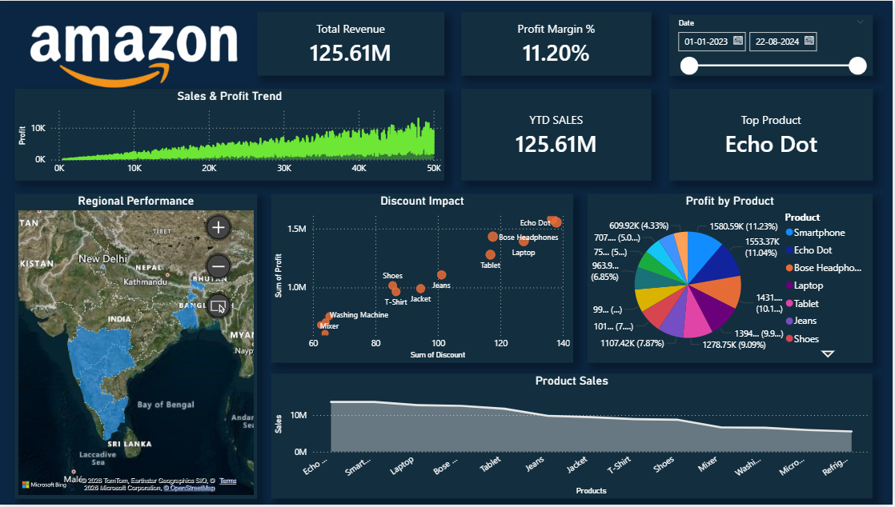

📊 Retail Business Performance Dashboard

📌 Project Overview

This project presents an interactive retail analytics dashboard built using Power BI to analyze key business metrics such as sales, profit, discount impact, and regional performance. The dashboard enables business stakeholders to monitor performance and make data-driven decisions.

🎯 Objectives

* Analyze overall sales and revenue trends
* Evaluate profitability using Profit Margin %
* Identify top-performing products
* Understand the impact of discounts on profit
* Compare regional performance across different states

🧹 Data Cleaning & Preparation

Before building the dashboard, the dataset was preprocessed to ensure accuracy and consistency:

* Handled missing or null values in key fields
* Corrected data types (dates, numeric values)
* Removed duplicate records
* Created calculated columns such as Profit Margin %
* Ensured consistency in categorical fields (Product, Region, State)

⚙️ Data Processing & Transformation

* Aggregated sales and profit metrics using DAX
* Created measures for Total Revenue, Total Profit, and Profit Margin %
* Implemented YTD (Year-to-Date) calculations
* Used TOPN function to identify top-performing products
* Applied filters and slicers for dynamic analysis

🛠️ Tools & Technologies

* Microsoft Power BI
* DAX (Data Analysis Expressions)
* CSV Dataset
* Microsoft Excel

🧠 Skills Demonstrated

* Data Analysis
* Data Cleaning & Preprocessing
* Data Visualization
* Dashboard Design
* DAX Calculations
* Business Insight Generation
* Problem Solving
* Analytical Thinking

📈 Key Features

* 📌 KPI Cards for Total Revenue, Profit Margin %, and YTD Sales
* 🏆 Top Product identification using DAX
* 📉 Sales & Profit trend analysis
* 🌍 Regional performance using map and bar charts
* 📊 Discount vs Profit analysis using scatter plot
* 🎛️ Interactive filters for dynamic exploration

🧠 Key Insights

* Echo Dot is the top-performing product by revenue
* Higher discounts negatively impact profitability
* Sales are concentrated in a few high-performing regions

📊 Dataset Description

The dataset contains retail transaction data including:

* Order Date
* Sales
* Profit
* Discount
* Product
* Category
* Region
* State

🚀 How to Use

1. Download the `.pbix` file
2. Open in Power BI Desktop
3. Use filters and slicers to explore insights
4. Interact with visuals for deeper analysis

👤 Author

Vishnu A Nambiar

